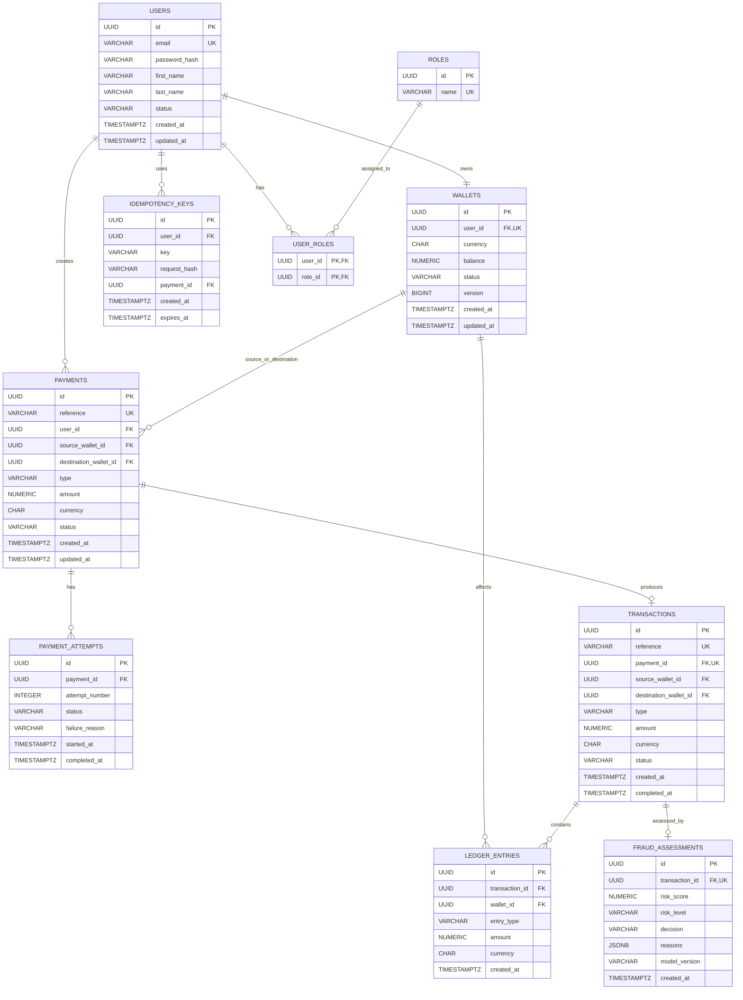

# PayFlow — Entity Relationship Diagram

## 1. Overview

This document provides the visual representation of the PayFlow Phase 5 database design.

PayFlow uses PostgreSQL as the authoritative source of truth for financial state.

The database is organized around these major concepts:

- **User** — account owner and identity
- **Role** — authorization role
- **Wallet** — current operational balance
- **Payment** — business operation/request
- **Payment Attempt** — processing attempt for a payment
- **Transaction** — financial event resulting from a payment
- **Ledger Entry** — immutable accounting movement
- **Idempotency Key** — protection against duplicate client requests
- **Fraud Assessment** — risk analysis associated with a transaction

---

# 2. Entity Relationship Diagram



---

# 3. Relationship Explanation

## User → Wallet

```text
User 1 ---- 1 Wallet
```

In the MVP, each user owns one wallet.

The database enforces this through:

```text
UNIQUE(wallets.user_id)
```

The relationship represents ownership of the user's operational wallet.

---

## User → Payment

```text
User 1 ---- N Payments
```

A user can initiate many payments.

For example:

```text
User A
 ├── Payment P001
 ├── Payment P002
 └── Payment P003
```

The payment stores the user responsible for initiating the operation.

---

## User ↔ Role

```text
User M ---- N Role
```

A user can have multiple roles, and a role can belong to multiple users.

The relationship is implemented through:

```text
USER_ROLES
```

Example:

```text
User
 ├── CUSTOMER
 └── SUPPORT
```

The primary key is:

```text
(user_id, role_id)
```

which prevents duplicate role assignments.

---

# 4. Wallet → Payment

A wallet can participate in many payments.

A payment can reference:

```text
source_wallet_id
destination_wallet_id
```

For example:

```text
Wallet A
   |
   | source
   v
Payment P001
   |
   | destination
   v
Wallet B
```

The same payment table therefore supports:

- Transfer
- Deposit
- Withdrawal

The application determines which wallet relationships are valid for each payment type.

---

# 5. Payment → Payment Attempt

```text
Payment 1 ---- N Payment Attempts
```

A payment represents the overall business operation.

An attempt represents one processing attempt.

Example:

```text
Payment P001

Attempt 1 -> FAILED
Attempt 2 -> FAILED
Attempt 3 -> COMPLETED
```

This distinction allows PayFlow to track retries without creating multiple payments for the same logical operation.

The database enforces:

```text
UNIQUE(payment_id, attempt_number)
```

---

# 6. Payment → Transaction

```text
Payment 1 ---- 0..1 Transaction
```

A payment does not necessarily produce a transaction.

For example:

```text
Payment P001 -> FAILED
                    |
                    X
               No transaction
```

But a successful payment can produce:

```text
Payment P002
     |
     v
Transaction T002
```

In the MVP, `transactions.payment_id` is UNIQUE, meaning one payment can produce at most one transaction.

---

# 7. Transaction → Ledger Entries

```text
Transaction 1 ---- N Ledger Entries
```

A transaction represents the financial event.

Ledger entries represent the accounting movements caused by that event.

For a transfer:

```text
Transaction T001
       |
       +---- DEBIT  Wallet A  ₹1,000
       |
       +---- CREDIT Wallet B  ₹1,000
```

The ledger therefore provides the accounting history behind the transaction.

---

# 8. Wallet → Ledger Entries

```text
Wallet 1 ---- N Ledger Entries
```

A wallet can have many ledger movements over its lifetime.

Example:

```text
Wallet A

Ledger Entry 1 -> CREDIT ₹5,000
Ledger Entry 2 -> DEBIT  ₹1,000
Ledger Entry 3 -> DEBIT  ₹500
Ledger Entry 4 -> CREDIT ₹2,000
```

This allows the system to reconstruct and audit financial activity.

---

# 9. Transaction → Fraud Assessment

```text
Transaction 1 ---- 0..1 Fraud Assessment
```

A transaction may have a fraud assessment.

Example:

```text
Transaction T001
       |
       v
Fraud Assessment
       |
       +-- risk_score = 87.50
       +-- risk_level = HIGH
       +-- decision = REVIEW
```

The MVP allows one fraud assessment per transaction through:

```text
UNIQUE(transaction_id)
```

Future versions may evolve this if multiple model evaluations or assessment versions are required.

---

# 10. User → Idempotency Key

```text
User 1 ---- N Idempotency Keys
```

An idempotency key represents a client's logical request.

Example:

```text
POST /api/payments

Idempotency-Key: ABC123
```

If the client retries the request:

```text
ABC123
ABC123
ABC123
```

the system should recognize that these requests represent the same logical operation.

The database enforces:

```text
UNIQUE(user_id, key)
```

The associated payment identifies the original operation.

---

# 11. Complete Financial Flow

The most important relationship to remember is:

```text
User
  |
  v
Wallet
  |
  v
Payment
  |
  +---- Payment Attempts
  |
  v
Transaction
  |
  +---- Fraud Assessment
  |
  v
Ledger Entries
```

For a transfer:

```text
User A
  |
  v
Wallet A
  |
  v
Payment
  |
  v
Transaction
  |
  +----------------------+
  |                      |
  v                      v
DEBIT Wallet A      CREDIT Wallet B
```

This is the core financial model of PayFlow.

---

# 12. Wallet Balance vs Ledger

An important design distinction:

```text
Wallet.balance
      |
      | Current operational state
      v
   ₹9,000
```

versus:

```text
Ledger
      |
      | Immutable financial history
      |
      +-- CREDIT ₹10,000
      +-- DEBIT  ₹1,000
```

The wallet balance answers:

> "How much money is currently available?"

The ledger answers:

> "What financial movements produced this state?"

They are related, but they are **not the same thing**.

---

# 13. Important Financial Invariant

For every completed transaction:

```text
Total DEBIT = Total CREDIT
```

Example:

```text
Transaction T001

DEBIT  Wallet A   ₹1,000
CREDIT Wallet B   ₹1,000

Total Debit  = ₹1,000
Total Credit = ₹1,000
```

Therefore:

```text
₹1,000 = ₹1,000
```

The database schema provides the structure required for this invariant, while application/service transaction logic and tests are responsible for enforcing the cross-row accounting rule.

---

# 14. Why This Design Is Structured This Way

The entities have different responsibilities:

| Entity | Responsibility |
|---|---|
| `users` | Identity/account owner |
| `roles` | Authorization role |
| `wallets` | Current operational balance |
| `payments` | Business operation/request |
| `payment_attempts` | Processing attempts |
| `transactions` | Financial event |
| `ledger_entries` | Accounting history |
| `idempotency_keys` | Duplicate request protection |
| `fraud_assessments` | Risk analysis |

This separation prevents one table from becoming responsible for unrelated concerns.

---

# 15. Phase 5 Database Boundary

The current Phase 5 database design intentionally focuses on the core financial domain.

Deferred tables include:

```text
notifications
ai_insights
transaction_categories
audit_logs
```

These will be introduced when their corresponding features are designed.

Database migration tooling is also intentionally deferred to:

**Phase 6 — Spring Boot Foundation**

The Phase 5 schema was manually created and verified in PostgreSQL for learning and database-design validation.
